# Circle Programmable Wallet SDK for Android

- Bookmark
  - [Requirement](#requirement)
  - [Run the Sample App](#run-the-sample-app)
  - [Create new wallet](#create-new-wallet)
  - [Login with existing wallet](#login-with-existing-wallet)
  - [Send tokens](#send-tokens)
  - [Simple code explanation](#simple-code-explanation)

---

## Requirement

1. Java 17 is required for the sample app.

## Run the Sample App

Clone the project from `https://github.com/nigeltay/web3-android--wallet`

```
git clone https://github.com/nigeltay/web3-android--wallet.git
```

1. Open the project by Android Studio: File ➜ Open ➜ choose the project root folder.
2. Edit `app/src/main/res/values/config.xml` ➜ `pw_app_id` and replace with`APP ID` found from https://console.circle.com/wallets/user/configurator.

```
<resources>
    <string name="pw_endpoint" translatable="false">https://api.circle.com/v1/w3s/</string>
    <string name="pw_app_id" translatable="false">REPLACE_WITH_YOUR_APP_ID</string>
</resources>
```

3. Create a `local.properties` in the root of the project directory with maven repository settings:

```properties
pwsdk.maven.url=https://maven.pkg.github.com/circlefin/w3s-android-sdk
# REPLACE <GITHUB_USERNAME> with your github username E.g.johnDoe
pwsdk.maven.username=<GITHUB_USERNAME>
# REPLACE <GITHUB_PAT> with your github token, token needs to be read access. Fine-grained personal access tokens or classic with package read permission.
pwsdk.maven.password=<GITHUB_PAT>
```

- Check following links for creating PAT.
  - [Creating a personal access token (classic)](https://docs.github.com/en/authentication/keeping-your-account-and-data-secure/managing-your-personal-access-tokens#creating-a-personal-access-token-classic)
  - [Creating a fine-grained personal access token](https://docs.github.com/en/authentication/keeping-your-account-and-data-secure/managing-your-personal-access-tokens#creating-a-fine-grained-personal-access-token)

4.  Go to `WalletCreationActivity.kt` file located at `app/src/main/java/com/circle/w3s/sample/wallet/` directory and replace `appId` variable with your own `APP_ID`.

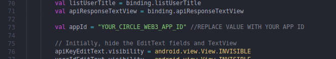

5.  Sync your project with gradle files by clicking on the button in the red box as shown below.


If gradle was sync successfully, you will see your sdk directory specified in the local-properties file.

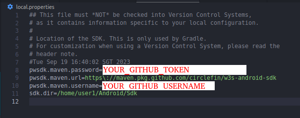

5.Make sure you have a emulator device ready. If not click on `Tools` -> `Device Manager` and create one. I am using the following emulator device by for testing:

- Device: Pixel 6
- API level: 33

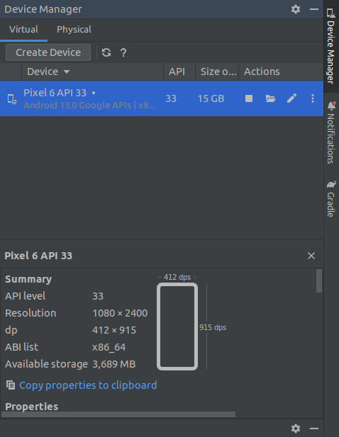

You can download new sdk version by clicking on `Tools` -> `SDK Manager`


6. Next, build the project by clicking on `Build` on the top tab and Click `Make Project`.

7. Lastly, click on `Run` tab at the top and click `Run 'app'`. Your emulator will load and the appilcation should start running on your emulator.

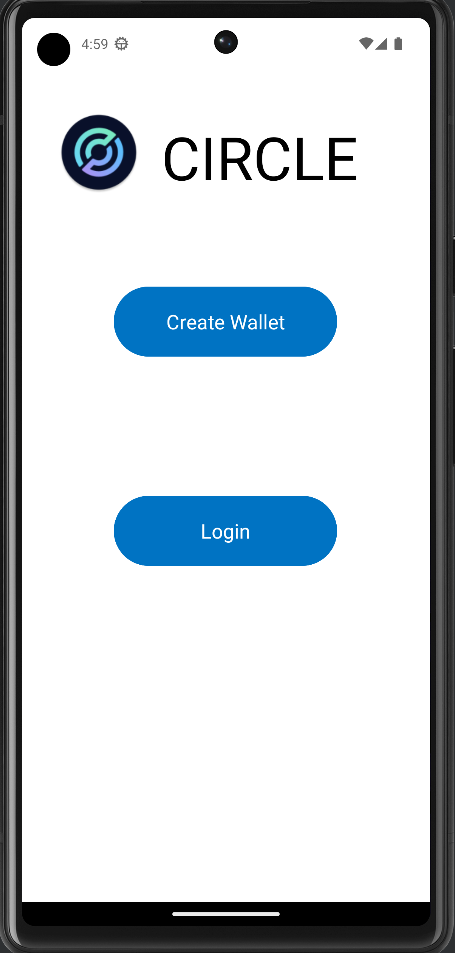

## Create new wallet

1. After the app is loading, Click on `Create Wallet` button.
2. Insert your API key and user id of your choice into the fields.
   (API key can be copied into your emulator clipboard no need to manually type. Choose a userId of your choice(minimum 5 characters) that is easily remembered like your name so that you wont forget it during login process.)

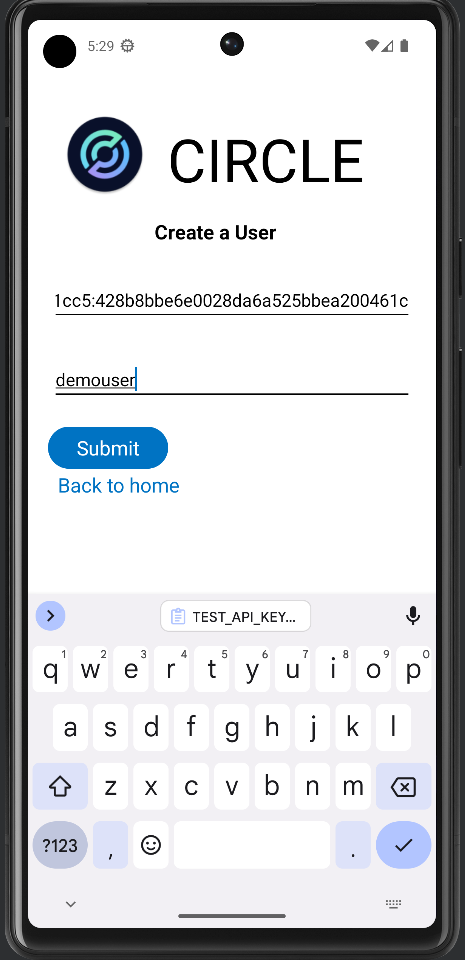

Click the submit button.

3. The user will be created and a session will be created for this userId. The app will then begin to intialise wallet creation where a challenge ID will be created and user is required to create a pin for future signing transactions as well as create some security questions.

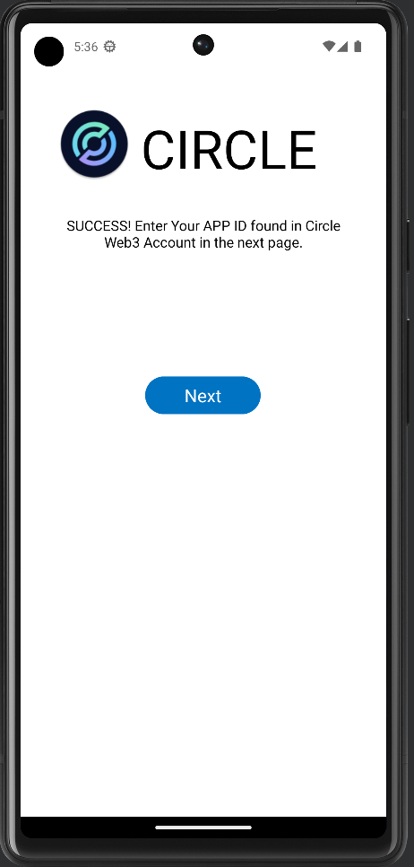

4. Click next. You will be redirected to input PIN.

5. In the next screen, enter a pin and remember it. The pin will be used to sign transactions for transfers etc.

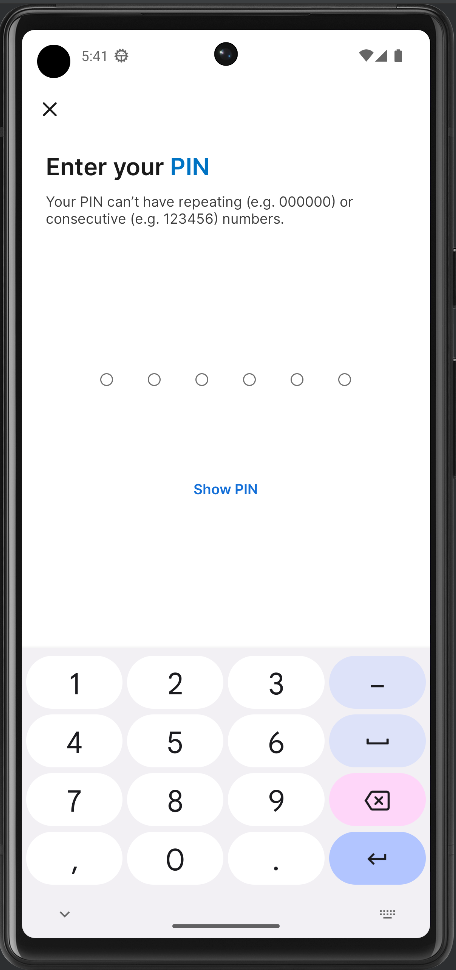

6. Then you will need to set some security questions for your wallet. Gt.O through the process and remember the answers. Click nex

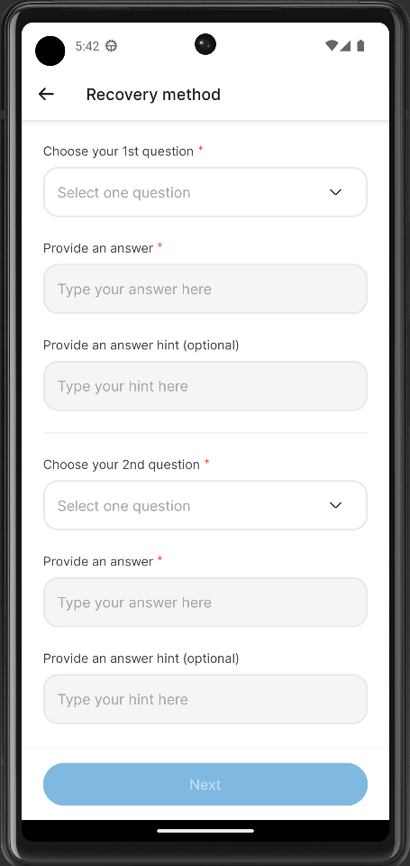

7. Next in the confirmation page, type `I agree` and click continue.

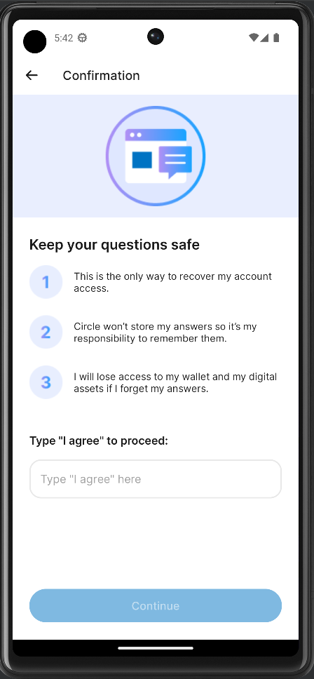

8. You will be routed to the homepage containing your wallet details. Click `Copy` to get your ETH Circle wallet address.

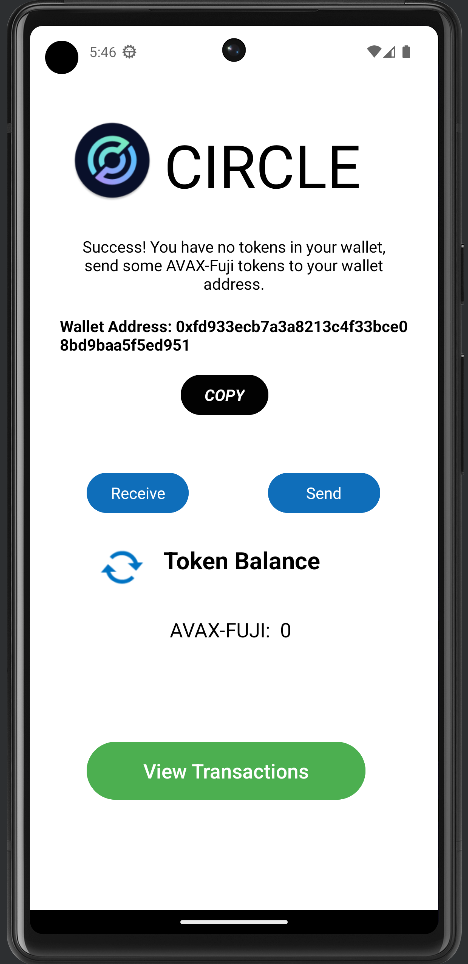

9. Now transfer some `ETH-SEPOLIA` or `USDC` tokens to that address that you have copied. E.g. You can transfer from your metamask wallet to that address.

Get some eth-sepolia tokens from

- https://www.alchemy.com/faucets/ethereum-sepolia

Once, you have transferred some eth or usdc tokens, click on the refresh icon located beside the token balance to see your updated tokens balance.

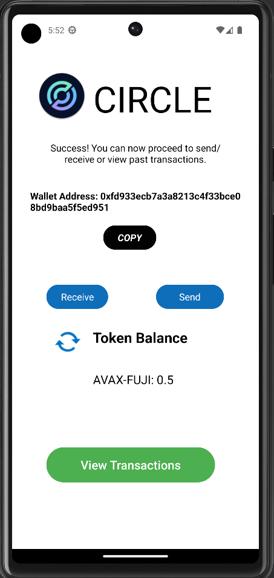

## Login with existing wallet

If you have created a wallet with the instructions from the previous section and want to login with the userId created before. Click on Login button. (Close the app and open if you came straight from the previous step by Clicking `Run` -> `Run app`.)

1. Input your `API key` and `User Id` from the previous step. Click `proceed`.

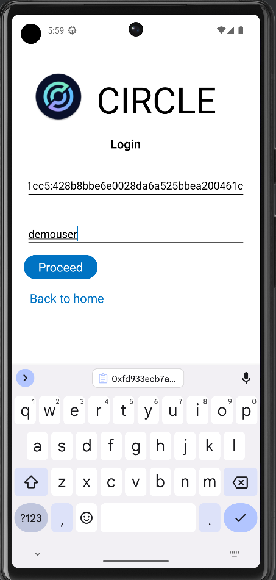

2. A session will be created for the user. You will be redirected to the wallet information page displaying your ETH-SEPOLIA tokens balance.


## Send tokens

1. Click `Send` button from the wallet info homepage.

2. Firstly choose either `USDC` or `ETH-SEPOLIA` from the dropdown list. Input token amount and recipient wallet address.
   (Amount cannot be more than balance or exactly token balance as gas fess are required as well. Transfer a small amount for testing. For recipient wallet, just use an exisiting Metamask wallet address). Click `Send`.

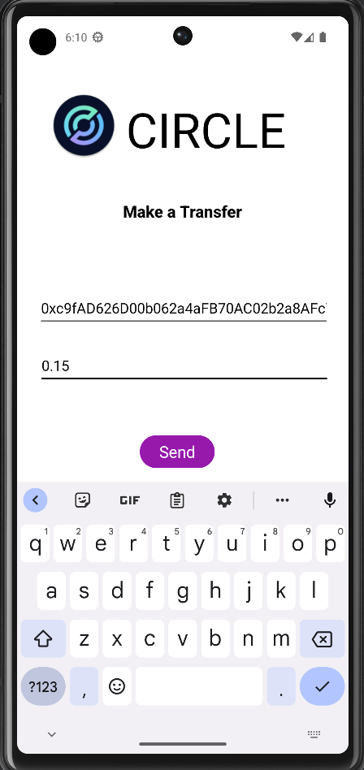

3. In the next page, similar to previous section when creating a wallet input your `APP ID` and do not edit the other values as the values are taken from a API response for creating a challenge ID. Click execute.

4. You will then be asked to input your PIN to sign the transction for transferring the tokens.

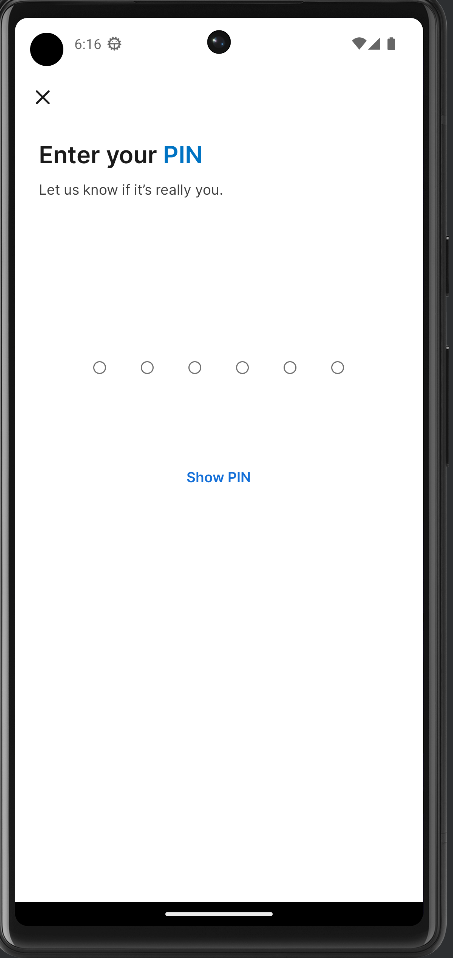

5. Once done, you will be redirected back to the wallet info home page. As the transfer might take some time (about 15 to 20s) for confirmations. You can take a look at the status by clicking on `View transactions` button.

You will be able to see the transactions for any ETH-SEPOLIA tokens that were transferred into or out of this wallet.

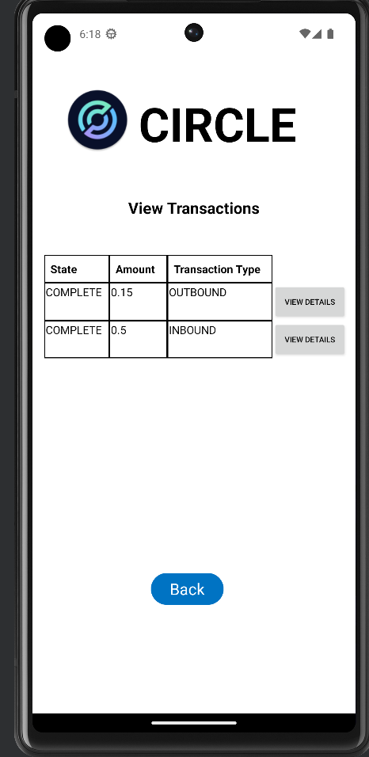

Transaction type

- OUTBOUND (Transfer OUT)
- INBOUND (Transfer IN)

Click `view details` on each row on view the detailed information of each transction.

 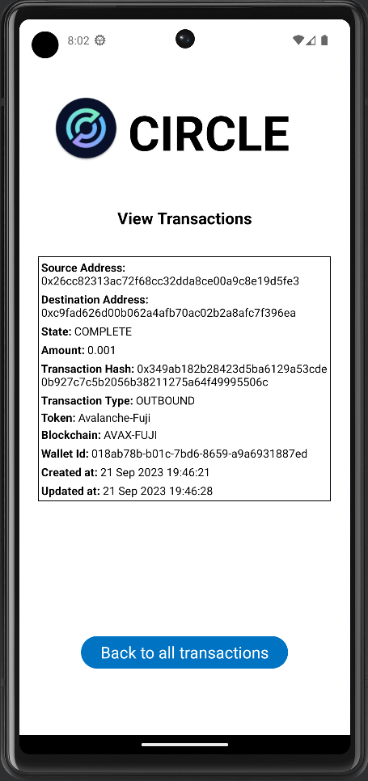

You can now go back to the wallet info homepage to view udpated balance or click refresh button to get updated balance of ETH-SEPOLIA tokens for your wallet.

## Simple code explanation

### Create wallet

- Files to look at:

  - `walletCreationActivity.kt` - Defines a class to represent an activity

    - On Submit Button click, Validates fields and calls `https://api.circle.com/v1/w3s/users` API endpoint to create a new user -> https://developers.circle.com/w3s/reference/createuser

    - On API response success - user is redirected to acquire session token on another page

    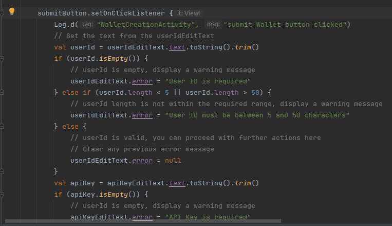

  - `walletcreationpage.xml` - define the layout and structure of UI - buttons, textViews etc

### Acquire session token

- Files to look at:

  - `AcquireSessionTokenActivity.kt`

    - On page load, an API called to create a token for the user created in the previous step at `https://api.circle.com/v1/w3s/users/token` -> https://developers.circle.com/w3s/reference/getusertoken

    - On API response success, a user token and encryption key is returned to the application
    - The application will pass the data to the next page as user is redirected to create and intialise a wallet

    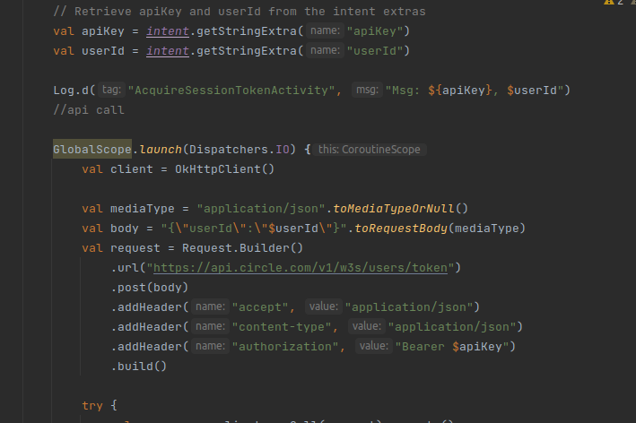

  - `acquire_session_token.xml` - define the layout and structure of UI - buttons, textViews etc

### Initialise User Wallet

- Files to look at:

  - `InitialiseUserWalletActivity.kt`

    - On page load, the application will call `https://api.circle.com/v1/w3s/user/initialize` endpoint to create a challenge for PIN setup and create wallet(s). -> https://developers.circle.com/w3s/reference/createuserwithpinchallenge

    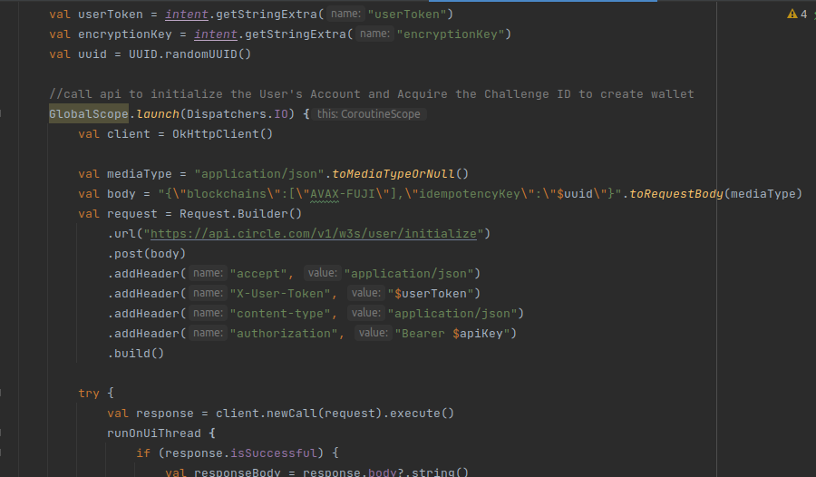

    - On API response success, an challenge Id string is returned and we will pass it to the next page where user will just need to input the APP ID.

  - `initialise_account.xml` - define the layout and structure of UI

### Input Challenge Id

- This section is used for

  - pinsetup and to create wallet
  - authenicate user when initating a transfer of tokens

- Files to look at:

  - `MainActivity.kt` - calls and display the `MainFragment.kt`
  - `MainFragment.kt` - Called as a fragment to represent a portion of the UI or a specific functionality within an activity.

    - Main function to look at `executePwSdk()`

      - inits and use Circle WalletSDK to execute the request. Depending on the type of challenge Id type it either
        - prompts user to create new PIN and sets security questions - use to create new wallet
        - Prompts user for PIN to authenicate and sign a request - use when initiate a transfer of token for exisiting wallet

        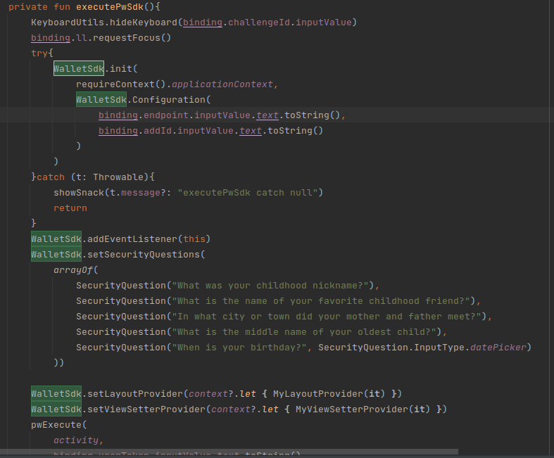

  - `fragment_main.xml` - UI layout of form fields for user to input and execute the challenge

### Get User Wallet Data

- Files to look at:

  - `HomePageActivity.xml`

    - On page load, two API points will be called to get the wallet data in sequence

      - First API endpoint, retrieves a list of all user-controlled wallet - `https://api.circle.com/v1/w3s/wallets` -> https://developers.circle.com/w3s/reference/listwallets

      - `getUserWalletId` function is called to page load.
        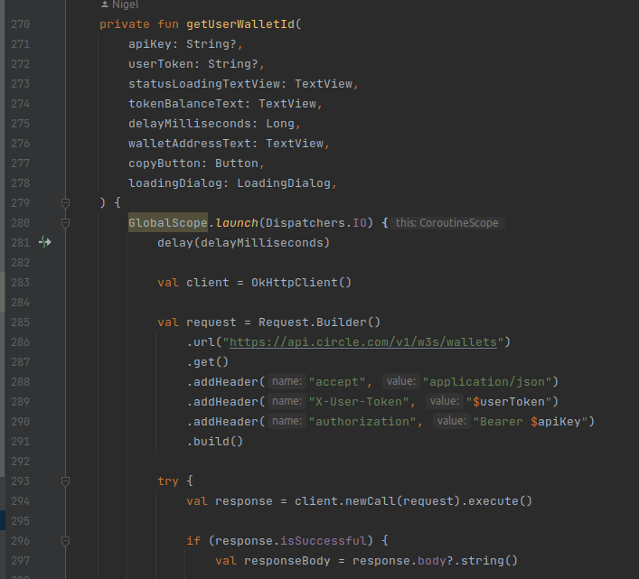

      - After 1st API call success, it will proceed to call `https://api.circle.com/v1/w3s/wallets/{id}/balances` to get the token balance of token(ETH-SEPOLIA) -> https://developers.circle.com/w3s/reference/listwalletballance

      - `getUserTokenBalance` function is then called from `getUserWalletId` after getting a wallet Id from the response. Wallet token balance is then retrieve from the API endpoint.
        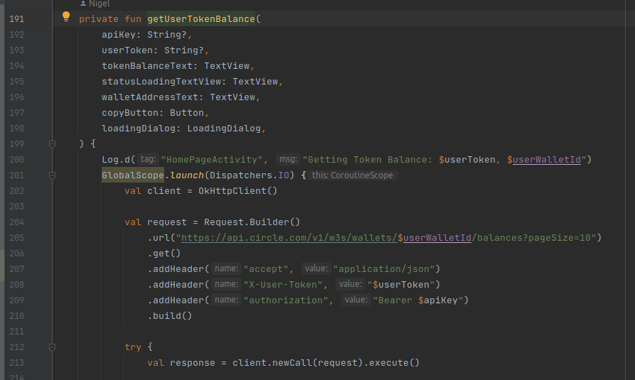

  - `homepage.xml` - define the layout and structure of UI

### Get list of transactions

- Files to look at:
- `TransactionsActivity.xml`

  - On page load,it calls the endpoint at `https://api.circle.com/v1/w3s/transactions` to retrieve all ETH-SEPOLIA chain transactions data that includes details such as status, source/destination, and transaction hash. -> https://developers.circle.com/w3s/reference/listtransactions

     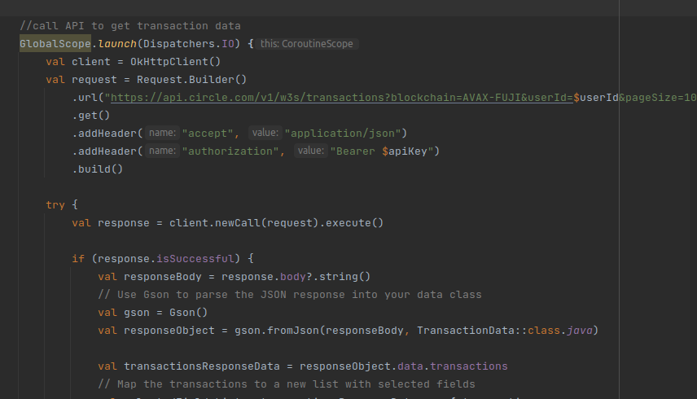

- `transactionspage.xml` - define the layout and structure of UI
